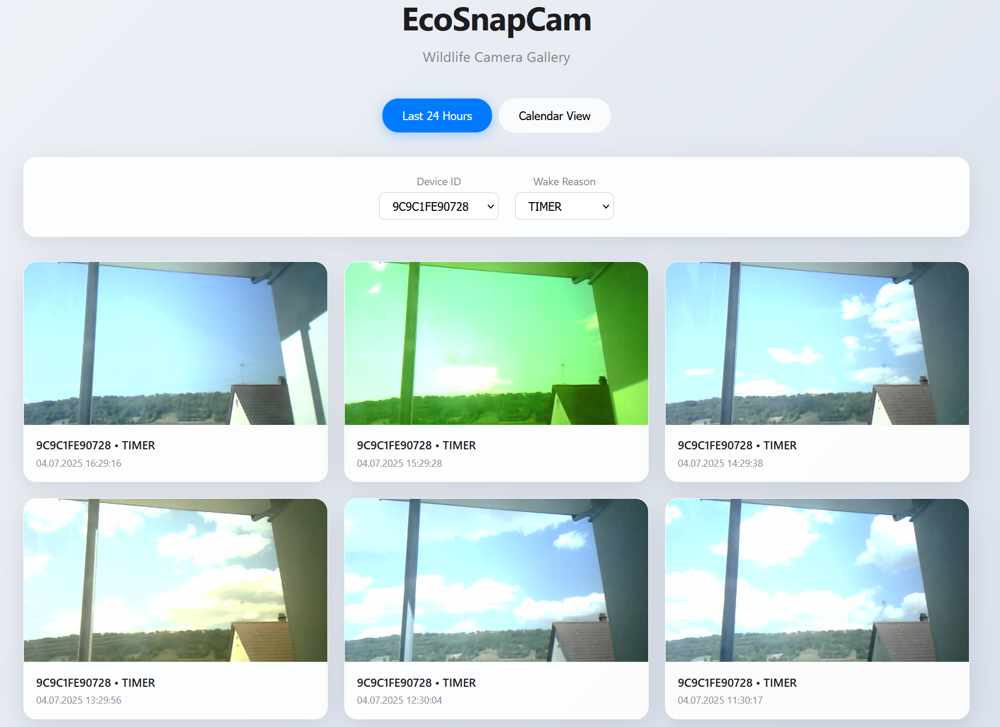
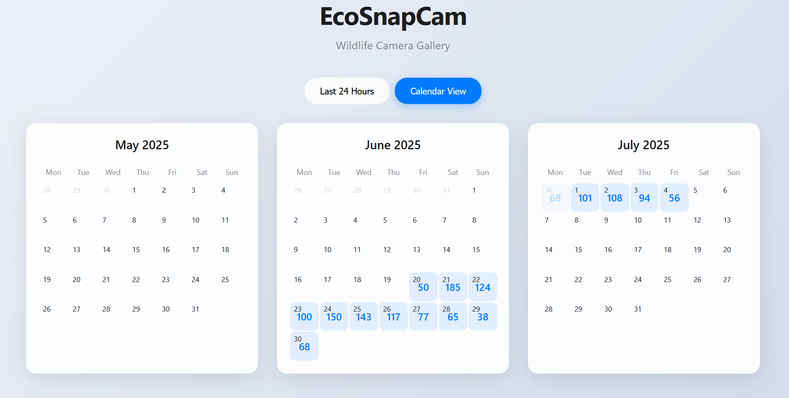

# EcoSnapCam


ESP32-CAM based wildlife camera with Deep Sleep for energy-efficient operation.
Supports image transmission via HTTP/HTTPS or ESP-NOW to a dedicated ESP32 receiver with a display (e.g., Cheap Yellow Display - CYD).

## Features

- **Energy-efficient**: Deep Sleep between captures with optimized Power Management
- **Flexible Transmission**: Image sending via HTTP/HTTPS POST or ESP-NOW
- **Motion Detection**: PIR sensor for additional motion-activated captures
- **Battery Monitoring**: Automatic voltage measurement and transmission of battery data
- **Easy Configuration**: Central configuration via `config.h` file
- **Display Support**: Display of received images on TFT displays (ESP-NOW mode)
- **Robust Transmission**: Chunked ESP-NOW transmission for larger images
- **AI Image Analysis**: Automatic wildlife detection and analysis with Ollama Vision Models
- **Intelligent Workflows**: Configurable AI processing with email notifications

## Hardware Prerequisites

**Sender (Camera Unit):**
- ESP32-CAM Module (AI-Thinker), Schematic ESP32-CAM
- FTDI Programmer or similar for USB-Serial programming, e.g.: ESP32-CAM-MB
- Power supply (Battery, Solar, etc.)
- **PIR Sensor** for motion-activated captures (Default: GPIO13)
- **Voltage Divider** for battery voltage measurement (Default: GPIO14)
- Weatherproof housing for outdoor use

**Receiver (optional, when using ESP-NOW):**
- ESP32 Development Board (e.g., ESP32 Dev Kit C, Wemos D1 Mini ESP32)
- TFT Display (e.g., "Cheap Yellow Display" - ESP32-2432S028R or other TFT_eSPI-compatible display)
- USB cable for power supply and programming

**Server (optional, when using HTTP Upload):**
- Web server with PHP support or Docker container
- **Ollama Server** for AI image analysis (recommended: locally installed)

## Installation

### 1. Repository Setup
```bash
git clone <repository-url>
cd EcoSnapCam
```

### 2. Sender Setup (ESP32-CAM)
```bash
# Create configuration file
cp src/sender_app/config_sample.h src/sender_app/config.h

# Adjust configuration (see Configuration section)
# Then flash:
pio run -e ecosnapcam_sender -t upload
```

### 3. Server Setup (for HTTP-Upload)
**Option A: Docker (recommended)**
```bash
# Start PHP server with Docker
mkdir my_php_server
cp upload.php my_php_server/
docker run -d -p 8080:80 --name ecosnapcam-server -v ./my_php_server:/var/www/html php:8-apache
```
Image gallery: `http://localhost:8080/upload.php`

**Option B: Own Web Server**
- Copy `upload.php` to your PHP-enabled web server
- Ensure write permissions for the upload directory

### 4. Receiver Setup (for ESP-NOW, optional)
```bash
# Adjust display configuration in platformio.ini
# Check ESP-NOW channel in src/receiver_app/main.cpp
pio run -e espnow_receiver -t upload
```

### 5. AI Image Analysis Setup (optional)
**Ollama Installation:**
```bash
# Download and install Ollama (Linux/Mac)
curl -fsSL https://ollama.ai/install.sh | sh

# Download vision model
ollama pull llava

# Start Ollama server
ollama serve
```

AI features are automatically activated when an Ollama server is running at `http://localhost:11434`. Workflows can be configured through the web interface.

## Web Interface

The image gallery features a modern, Apple-inspired user interface with two view modes:

### Gallery View (Last 24 Hours)


### Calendar View (Last 3 Months) 


**Features:**
- **Modern UI**: Apple-style design with glassmorphism effects
- **Gallery View**: Shows images from the last 24 hours as cards
- **Calendar View**: Overview of the last 3 months with image counters per day
- **Responsive**: Optimized for desktop and mobile
- **Filters**: By device ID and wake reason
- **Modal Viewer**: Full-screen image display
- **AI Integration**: Automatic image analysis and workflow management

## Configuration

### Sender Configuration (`src/sender_app/config.h`)

The main configuration is done in `src/sender_app/config.h`. Here you define WLAN credentials, server URL, and the transmission mode (HTTP or ESP-NOW).

**HTTP/HTTPS Upload (Default):**
```cpp
// WiFi credentials
const char* ssid = "YOUR_WIFI_SSID";
const char* password = "YOUR_WIFI_PASSWORD";

// Server URL for HTTP/HTTPS Upload
const char* serverURL = "http://YOUR_SERVER.COM/upload.php";

// Disable ESP-NOW
#define USE_ESP_NOW false
```

**ESP-NOW Upload (for local transmission):**
```cpp
// Enable ESP-NOW
#define USE_ESP_NOW true

#if USE_ESP_NOW
// MAC address of the receiver (or broadcast)
static uint8_t espNowReceiverMac[] = {0xFF, 0xFF, 0xFF, 0xFF, 0xFF, 0xFF};

// WLAN channel (must match receiver)
#define ESP_NOW_CHANNEL 1 // Default channel 1
#endif
```
The camera now uses automatic exposure settings. The previous `EXPOSURE_MODE` setting has been removed.

### Receiver Configuration

**Display Settings** (`platformio.ini`):
```ini
build_flags =
    -D ILI9341_DRIVER        ; Display driver
    -D TFT_WIDTH=320         ; Display width
    -D TFT_HEIGHT=240        ; Display height
    -D TFT_MOSI=13           ; SPI MOSI Pin
    -D TFT_SCLK=14           ; SPI Clock Pin
    -D TFT_CS=15             ; Chip Select Pin
    -D TFT_DC=2              ; Data/Command Pin
    -D TFT_RST=4             ; Reset Pin
    -D TFT_BL=21             ; Backlight Pin
```

**ESP-NOW Channel** (`src/receiver_app/main.cpp`):
```cpp
#define ESP_NOW_RECEIVER_CHANNEL 1  // Must match sender
```

### AI Workflow Configuration

**Via Web Interface:**
AI features are configured through the web interface (`http://localhost:8080/upload.php`):

1. **Create Workflows**: New AI analysis workflows for different cameras or scenarios
2. **Set Filters**: By ESP device ID or wake reason (PIR, TIMER, POWERON)
3. **Customize Prompts**: User-defined AI prompts for special analysis requirements
4. **Configure Email**: Automatic notifications for interesting discoveries
5. **Choose Model**: Different Ollama Vision Models (default: llava)

**Example Workflow:**
- **Filter**: `esp_id = "CAM_01"` (camera 1 only)
- **Prompt**: `"Identify wildlife in this image. Describe species, count, and behavior in detail."`
- **Email**: Notifications for animal sightings
- **Model**: `llava` (or other available Vision Models)

## Hardware Details

### Sender (ESP32-CAM)

**PIR Sensor (GPIO13):**
- Enables motion-activated captures in addition to the timer
- Wakeup from Deep Sleep upon motion detection
- Pin is RTC-capable for Deep Sleep Wakeup

**Battery Voltage Measurement (GPIO14):**
- Automatic voltage measurement on every wakeup
- Transmitted as a GET parameter (`?vbat=XXXX`) with HTTP upload
- Displayed on receiver display with ESP-NOW
- **Important:** Use a voltage divider: VCC (3.3V pin) → 100kΩ → GPIO14 → 100kΩ → GND.

**Camera Settings:**
- The camera uses automatic exposure and white balance settings.
- Before the actual capture (in HTTP mode), some dummy shots are taken to allow the sensor to adjust to light conditions. This improves image quality in difficult lighting conditions.

**Power Management:**
- Deep Sleep between captures (Default: 15 minutes)
- Automatic deactivation of unnecessary peripherals
- Optimized WiFi Power Save Modes
- Reduced CPU frequency during upload

### Receiver (ESP32 + Display)

**Supported Displays:**
- Cheap Yellow Display (CYD) - ESP32-2432S028R
- All TFT_eSPI-compatible displays
- ILI9341, ILI9342, ST7789 and more

**ESP-NOW Features:**
- Chunked transmission for large images (up to 50KB)
- Automatic image display on display
- Battery status display
- Robust error handling

## Technical Specifications

- **Image Resolution:** SVGA (800x600) JPEG
- **Image Quality:** Optimized for file size and transmission
- **Sleep Time:** 15 minutes (configurable)
- **Transmission Modes:** HTTP/HTTPS POST, ESP-NOW
- **ESP-NOW Range:** Up to 200m (line of sight)
- **Power Consumption:** ~3mA in Deep Sleep (with 3.3V direct supply)
- **Operating Voltage:** 3.3V (ESP32-CAM)
- **AI Processing:** Ollama Vision Models (llava, others)
- **Automation:** File-based Locking, Concurrent Processing Protection

## AI Image Analysis and Wildlife Detection

EcoSnapCam features advanced AI capabilities for automatic analysis of wildlife camera captures:

### Core Features

**Automatic Image Analysis:**
- **Ollama Integration**: Uses local Vision Language Models (LLMs) for privacy
- **Wildlife Detection**: Automatic identification of animals, their behavior and activities
- **Real-time Processing**: Every uploaded image is automatically analyzed
- **Multi-Model Support**: Supports various Ollama Vision Models (llava, etc.)

**Intelligent Workflows:**
- **Filterable Processing**: Targeted processing by ESP device ID or trigger type (PIR/Timer/PowerOn)
- **Custom Prompts**: Customizable AI analysis instructions for different scenarios
- **Automatic Email Notifications**: Instant notifications for interesting discoveries
- **Database-driven**: SQLite-based workflow management with web interface

### Technical Features

**Resource Protection:**
- **File-based Locking**: Prevents system overload during multiple simultaneous requests
- **Timeout Management**: 5-minute timeout with automatic lock cleanup
- **Concurrent Processing Protection**: Prevents competing Ollama requests

**Data Processing:**
- **Metadata Extraction**: Automatic capture of ESP-ID, wake reason, timestamp and battery status
- **Base64 Image Transfer**: Efficient transmission to Ollama API
- **Result Storage**: Complete archiving of all AI analysis results

### Application Examples

**Wildlife Monitoring:**
```
Prompt: "Identify all wildlife in this image. Describe species, count, 
behavior and estimated size. Pay special attention to rare or unusual species."
```

**Behavior Analysis:**
```
Prompt: "Analyze the behavior of the animals. Are they feeding, drinking, 
in mating season, or showing territorial behavior?"
```

**Habitat Assessment:**
```
Prompt: "Describe the environment and assess habitat quality. 
What plants are visible and what is the general condition of the ecosystem?"
```

### Setup and Configuration

AI features are **plug-and-play** and automatically activated when:
1. An Ollama server is running at `http://localhost:11434`
2. A Vision Model (e.g. `llava`) is installed
3. Workflows are configured via the web interface

**Default Configuration:**
- **Model**: `llava` (recommended for wildlife detection)
- **Endpoint**: `http://localhost:11434/api/generate`
- **Processing**: Automatic for all new uploads
- **Storage**: SQLite database in server directory

## Power Consumption and Hardware Optimization

The optimized Deep Sleep code achieves a power consumption of approx. **3mA in Deep Sleep** with direct 3.3V supply (AMS1117 voltage regulator bypassed).

**Important Notes on Power Consumption:**
- The 3mA was measured with a direct supply of 3.3V to the 3.3V input
- This bypasses the AMS1117 voltage regulator, which alone consumes approx. 1.5-5mA
- Lower values are only possible through hardware modifications due to the design of the ESP32-CAM module
- For more details on hardware optimization, see: How to decrease the deep-sleep current of ESP32-CAM


**Hardware Limitations:**
- The OV2640 camera is permanently connected to 3.3V and consumes power even in Deep Sleep
- The microSD card (if inserted) consumes an additional approx. 200µA
- Without camera and SD card, <1mA would theoretically be possible, but this would negate the functionality

## Troubleshooting

**Camera does not initialize:**
- Check power supply (min. 500mA)
- Camera module firmly inserted
- GPIO0 to GND during programming

**WiFi connection fails:**
- Check SSID and password in `config.h`
- Test WiFi signal at the location
- Use 2.4GHz WLAN (not 5GHz)

**Images overexposed/underexposed:**
- The camera now uses automatic exposure with initial dummy shots for adjustment. This should resolve most issues.
- Ensure the camera lens is clean.
- In extreme lighting conditions (e.g., direct sunlight into the lens), quality degradation may still occur.

**ESP-NOW does not work:**
- Check channel settings between sender and receiver
- Enter receiver's MAC address correctly
- Reduce distance between devices

**AI image analysis not working:**
- Check Ollama server status: `ollama list` (should show installed models)
- Start Ollama service: `ollama serve`
- Install vision model: `ollama pull llava`
- Check web interface workflow status (shows Ollama availability)
- Check log files in server directory for detailed error messages

**Workflows not executing:**
- Check filename format (ESP-ID and wake reason must be extractable)
- Verify workflow filters (ESP-ID/Wake-reason matching)
- Check SQLite database permissions
- Confirm Ollama model compatibility (`llava` for image analysis)

## License

**Private use only** - Open Source for private and non-commercial use.

**Commercial use only after consultation with MeiLuft.**

See [LICENSE](LICENSE) file for details.