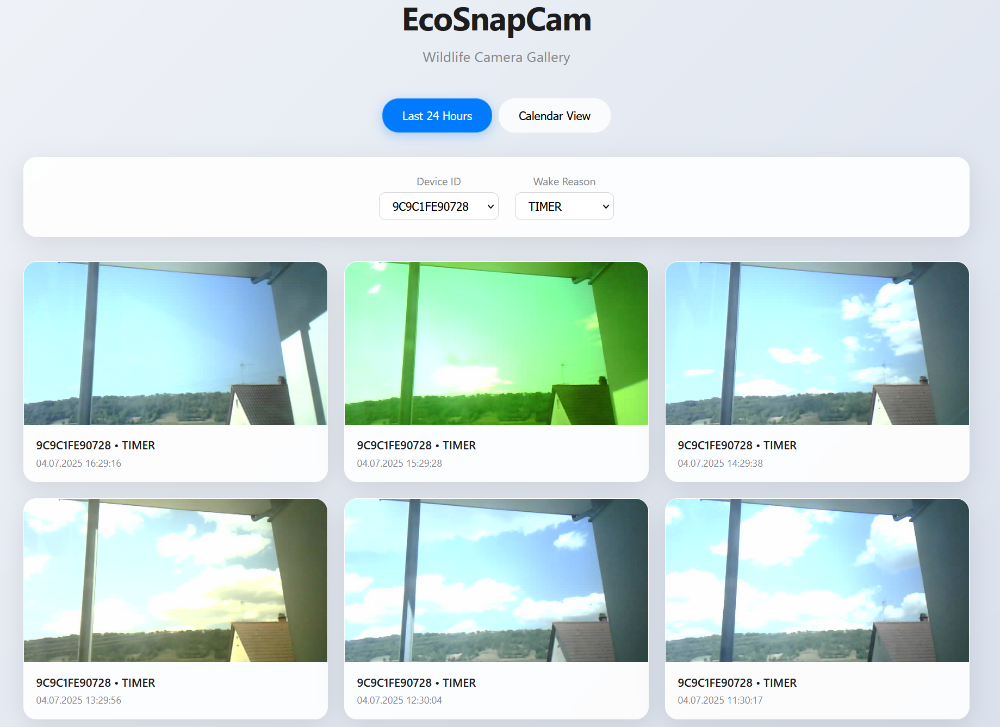
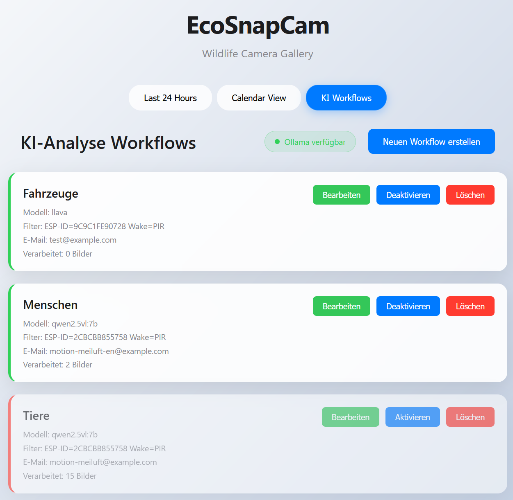

# EcoSnapCam


ESP32-CAM basierte Wildkamera mit Deep Sleep für energieeffizienten Betrieb.
Unterstützt Bildübertragung via HTTP/HTTPS oder ESP-NOW an einen dedizierten ESP32-Empfänger mit Display (z.B. Cheap Yellow Display - CYD).

## Funktionen

- **Energieeffizient**: Deep Sleep zwischen Aufnahmen mit optimiertem Power Management
- **Flexible Übertragung**: Bildversendung per HTTP/HTTPS POST oder ESP-NOW
- **Bewegungserkennung**: PIR-Sensor für zusätzliche bewegungsaktivierte Aufnahmen
- **Batteriemonitoring**: Automatische Spannungsmessung und Übertragung der Batteriedaten
- **Einfache Konfiguration**: Zentrale Konfiguration über `config.h` Datei
- **Display-Unterstützung**: Anzeige empfangener Bilder auf TFT-Displays (ESP-NOW Modus)
- **Robuste Übertragung**: Chunked ESP-NOW Übertragung für größere Bilder
- **KI-Bildanalyse**: Automatische Wildtiererkennung und -analyse mit Ollama Vision Models
- **Multi-Messenger-Benachrichtigungen**: E-Mail, Discord und Nextcloud Talk Support
- **Intelligente Workflows**: Konfigurierbare KI-Verarbeitung mit Bild-Attachments

## Hardware Voraussetzungen

**Sender (Kamera-Einheit):**
- ESP32-CAM Modul (AI-Thinker), [Schematic ESP32-CAM](https://github.com/SeeedDocument/forum_doc/blob/master/reg/ESP32_CAM_V1.6.pdf)
- FTDI Programmer oder ähnliches für USB-Serial Programmierung, z.B.: [ESP32-CAM-MB](https://www.espboards.dev/blog/flash-any-esp32-with-esp32-cam-mb/)
- Stromversorgung (Batterie, Solar, etc.)
- **PIR-Sensor** für bewegungsaktivierte Aufnahmen (Standard: GPIO13)
- **Spannungsteiler** für Batteriespannungsmessung (Standard: GPIO14)
- Wetterfestes Gehäuse für Außeneinsatz

**Empfänger (optional, bei Verwendung von ESP-NOW):**
- ESP32 Entwicklungsboard (z.B. ESP32 Dev Kit C, Wemos D1 Mini ESP32)
- TFT Display (z.B. "Cheap Yellow Display" - ESP32-2432S028R oder anderes TFT_eSPI-kompatibles Display)
- USB-Kabel für Stromversorgung und Programmierung

**Server (optional, bei Verwendung von HTTP Upload):**
- Webserver mit PHP-Unterstützung oder Docker-Container
- **Ollama Server** für KI-Bildanalyse (empfohlen: lokal installiert)

## Installation

### 1. Repository Setup
```bash
git clone <repository-url>
cd EcoSnapCam
```

### 2. Sender Setup (ESP32-CAM)
```bash
# Konfigurationsdatei erstellen
cp src/sender_app/config_sample.h src/sender_app/config.h

# Konfiguration anpassen (siehe Konfiguration-Sektion)
# Dann flashen:
pio run -e ecosnapcam_sender -t upload
```

### 3. Server Setup (für HTTP-Upload)
**Option A: Docker (empfohlen)**
```bash
# PHP-Server mit Docker starten
mkdir my_php_server
cp upload.php my_php_server/
docker run -d -p 8080:80 --name ecosnapcam-server -v ./my_php_server:/var/www/html php:8-apache
```
Bildergalerie: `http://localhost:8080/upload.php`

**Option B: Eigener Webserver**
- `upload.php` auf Ihren PHP-fähigen Webserver kopieren
- Schreibrechte für das Upload-Verzeichnis sicherstellen

### 4. Empfänger Setup (für ESP-NOW, optional)
```bash
# Display-Konfiguration in platformio.ini anpassen
# ESP-NOW Kanal in src/receiver_app/main.cpp prüfen
pio run -e espnow_receiver -t upload
```

### 5. KI-Bildanalyse Setup (optional)
**Ollama Installation:**
```bash
# Ollama herunterladen und installieren (Linux/Mac)
curl -fsSL https://ollama.ai/install.sh | sh

# Vision Model herunterladen
ollama pull llava

# Ollama Server starten
ollama serve
```

Die KI-Funktionen sind automatisch aktiviert, wenn ein Ollama-Server unter `http://localhost:11434` läuft. Workflows können über das Web-Interface konfiguriert werden.

## Web-Interface

Die Bildergalerie bietet eine moderne, Apple-inspirierte Benutzeroberfläche mit zwei Ansichtsmodi:

### Galerie-Ansicht (Letzte 24 Stunden)


### Kalender-Ansicht (Letzte 3 Monate) 


**Features:**
- **Moderne UI**: Apple-Style Design mit Glasmorphismus-Effekten
- **Galerie-Ansicht**: Zeigt Bilder der letzten 24 Stunden als Karten
- **Kalender-Ansicht**: Übersicht der letzten 3 Monate mit Bildzählern pro Tag
- **Responsive**: Optimiert für Desktop und Mobile
- **Filter**: Nach Geräte-ID und Aufwachgrund
- **Modal-Viewer**: Vollbild-Bildanzeige
- **KI-Integration**: Automatische Bildanalyse und Multi-Messenger-Benachrichtigungen

## Konfiguration

### Sender-Konfiguration (`src/sender_app/config.h`)

Die Hauptkonfiguration erfolgt in `src/sender_app/config.h`. Hier legen Sie WLAN-Zugangsdaten, Server-URL und den Übertragungsmodus (HTTP oder ESP-NOW) fest.

**HTTP/HTTPS Upload (Standard):**
```cpp
// WiFi Zugangsdaten
const char* ssid = "DEIN_WLAN_SSID";
const char* password = "DEIN_WLAN_PASSWORT";

// Server URL für HTTP/HTTPS Upload
const char* serverURL = "http://DEIN_SERVER.DE/upload.php";

// ESP-NOW deaktivieren
#define USE_ESP_NOW false
```

**ESP-NOW Upload (für lokale Übertragung):**
```cpp
// ESP-NOW aktivieren
#define USE_ESP_NOW true

#if USE_ESP_NOW
// MAC-Adresse des Empfängers (oder Broadcast)
static uint8_t espNowReceiverMac[] = {0xFF, 0xFF, 0xFF, 0xFF, 0xFF, 0xFF};

// WLAN-Kanal (muss mit Empfänger übereinstimmen)
#define ESP_NOW_CHANNEL 1 // Standardmäßig Kanal 1
#endif
```
Die Kamera verwendet nun automatische Belichtungseinstellungen. Die vorherige `EXPOSURE_MODE` Einstellung wurde entfernt.

### Empfänger-Konfiguration

**Display-Einstellungen** (`platformio.ini`):
```ini
build_flags =
    -D ILI9341_DRIVER        ; Display-Treiber
    -D TFT_WIDTH=320         ; Display-Breite
    -D TFT_HEIGHT=240        ; Display-Höhe
    -D TFT_MOSI=13           ; SPI MOSI Pin
    -D TFT_SCLK=14           ; SPI Clock Pin
    -D TFT_CS=15             ; Chip Select Pin
    -D TFT_DC=2              ; Data/Command Pin
    -D TFT_RST=4             ; Reset Pin
    -D TFT_BL=21             ; Backlight Pin
```

**ESP-NOW Kanal** (`src/receiver_app/main.cpp`):
```cpp
#define ESP_NOW_RECEIVER_CHANNEL 1  // Muss mit Sender übereinstimmen
```

### KI-Workflow-Konfiguration

**Über das Web-Interface:**
Die KI-Funktionen werden über das Web-Interface konfiguriert (`http://localhost:8080/upload.php`):

1. **Workflow erstellen**: Neue KI-Analyse-Workflows für verschiedene Kameras oder Szenarien
2. **Filter einstellen**: Nach ESP-Geräte-ID oder Aufwachgrund (PIR, TIMER, POWERON)  
3. **Prompts anpassen**: Benutzerdefinierte KI-Prompts für spezielle Analyseanforderungen
4. **Benachrichtigungskanäle wählen**: E-Mail, Discord, Nextcloud Talk (einzeln oder kombiniert)
5. **Bild-Attachments**: Analysierte Wildkamera-Bilder direkt mitversenden
6. **Modell wählen**: Verschiedene Ollama Vision Models (Standard: llava)

**Beispiel-Workflow:**
- **Filter**: `esp_id = "CAM_01"` (nur Kamera 1) 
- **Prompt**: `"Erkenne Wildtiere in diesem Bild. Beschreibe Art, Anzahl und Verhalten detailliert."`
- **Benachrichtigungen**: 📧 E-Mail + 💬 Discord (mit Bild 📸)
- **Modell**: `llava` (oder andere verfügbare Vision Models)

## Hardware-Details

### Sender (ESP32-CAM)

**PIR-Sensor (GPIO13):**
- Ermöglicht bewegungsaktivierte Aufnahmen zusätzlich zum Timer
- Wakeup aus Deep Sleep bei Bewegungserkennung
- Pin ist RTC-fähig für Deep Sleep Wakeup

**Batteriespannungsmessung (GPIO14):**
- Automatische Spannungsmessung bei jedem Aufwachen
- Übertragung als GET-Parameter (`?vbat=XXXX`) bei HTTP-Upload
- Anzeige auf Empfänger-Display bei ESP-NOW
- **Wichtig:** Spannungsteiler verwenden: VCC (3.3V pin) → 100kΩ → GPIO14 → 100kΩ → GND.

**Kameraeinstellungen:**
- Die Kamera verwendet automatische Belichtungs- und Weißabgleichseinstellungen.
- Vor der eigentlichen Aufnahme (im HTTP-Modus) werden einige Dummy-Aufnahmen gemacht, damit sich der Sensor an die Lichtverhältnisse anpassen kann. Dies verbessert die Bildqualität bei schwierigen Lichtbedingungen.

**Power Management:**
- Deep Sleep zwischen Aufnahmen (Standard: 15 Minuten)
- Automatische Deaktivierung nicht benötigter Peripherie
- Optimierte WiFi Power Save Modi
- Reduzierte CPU-Frequenz während Upload

### Empfänger (ESP32 + Display)

**Unterstützte Displays:**
- Cheap Yellow Display (CYD) - ESP32-2432S028R
- Alle TFT_eSPI-kompatiblen Displays
- ILI9341, ILI9342, ST7789 und weitere

**ESP-NOW Features:**
- Chunked Übertragung für große Bilder (bis 50KB)
- Automatische Bildanzeige auf Display
- Batteriestatus-Anzeige
- Robuste Fehlerbehandlung

## Technische Spezifikationen

- **Bildauflösung:** SVGA (800x600) JPEG
- **Bildqualität:** Optimiert für Dateigröße und Übertragung
- **Sleep-Zeit:** 15 Minuten (konfigurierbar)
- **Übertragungsarten:** HTTP/HTTPS POST, ESP-NOW
- **ESP-NOW Reichweite:** Bis zu 200m (Sichtlinie)
- **Stromverbrauch:** ~3mA im Deep Sleep (bei 3.3V Direkteinspeisung)
- **Betriebsspannung:** 3.3V (ESP32-CAM)
- **KI-Verarbeitung:** Ollama Vision Models (llava, andere)
- **Automatisierung:** File-based Locking, Concurrent Processing Protection

## KI-Bildanalyse und Wildtiererkennung

EcoSnapCam verfügt über fortschrittliche KI-Funktionen zur automatischen Analyse von Wildkamera-Aufnahmen:

### KI-Workflow-Verwaltung


Die KI-Workflows ermöglichen die Konfiguration verschiedener Analyseszenarien mit spezifischen Filtern, AI-Modellen und E-Mail-Benachrichtigungen.

### Kernfunktionen

**Automatische Bildanalyse:**
- **Ollama Integration**: Nutzt lokale Vision Language Models (LLMs) für Datenschutz
- **Wildtiererkennung**: Automatische Identifizierung von Tieren, deren Verhalten und Aktivitäten  
- **Echtzeit-Verarbeitung**: Jedes hochgeladene Bild wird automatisch analysiert
- **Multi-Model Support**: Unterstützt verschiedene Ollama Vision Models (llava, etc.)

**Intelligente Workflows:**
- **Filterbare Verarbeitung**: Gezieltes Processing nach ESP-Geräte-ID oder Trigger-Typ (PIR/Timer/PowerOn)
- **Benutzerdefinierte Prompts**: Anpassbare KI-Analyseanweisungen für verschiedene Szenarien
- **Multi-Messenger-Support**: E-Mail, Discord, Nextcloud Talk (einzeln oder kombiniert)
- **Bild-Attachments**: Wildkamera-Bilder direkt in Benachrichtigungen (Discord)
- **Datenbankgesteuert**: SQLite-basierte Workflow-Verwaltung mit Web-Interface

### Technische Features

**Ressourcenschutz:**
- **File-based Locking**: Verhindert Systemüberlastung bei mehreren gleichzeitigen Requests  
- **Timeout-Management**: 5-Minuten-Timeout mit automatischer Lock-Bereinigung
- **Concurrent Processing Protection**: Verhindert konkurrierende Ollama-Anfragen

**Datenverarbeitung:**
- **Metadaten-Extraktion**: Automatische Erfassung von ESP-ID, Aufwachgrund, Timestamp und Batteriestatus
- **Base64-Bildübertragung**: Effiziente Übertragung an Ollama API
- **Ergebnisspeicherung**: Vollständige Archivierung aller KI-Analyseergebnisse

### Anwendungsbeispiele

**Wildtiermonitoring mit Discord:**
```
Kanäle: 💬 Discord (mit Bild 📸)
Prompt: "Identifiziere alle Wildtiere in diesem Bild. Beschreibe Art, Anzahl, 
Verhalten und geschätzte Größe. Achte besonders auf seltene oder ungewöhnliche Arten."
```

**Verhaltensanalyse mit Multi-Messenger:**
```
Kanäle: 📧 E-Mail + 💬 Discord + ☁️ Nextcloud Talk
Prompt: "Analysiere das Verhalten der Tiere. Sind sie beim Fressen, Trinken, 
in der Paarungszeit oder zeigen sie territoriales Verhalten?"
```

**Habitatbewertung mit Bild-Attachments:**
```
Kanäle: 📧 E-Mail + 💬 Discord (mit Bild 📸)
Prompt: "Beschreibe die Umgebung und beurteile die Habitatqualität. 
Welche Pflanzen sind sichtbar und wie ist der allgemeine Zustand des Ökosystems?"
```

### Setup und Konfiguration

Die KI-Features sind **plug-and-play** und werden automatisch aktiviert, wenn:
1. Ein Ollama-Server auf `http://localhost:11434` läuft
2. Ein Vision Model (z.B. `llava`) installiert ist  
3. Workflows über das Web-Interface konfiguriert wurden

**Standard-Konfiguration:**
- **Model**: `llava` (empfohlen für Wildtiererkennung)
- **Endpoint**: `http://localhost:11434/api/generate`
- **Verarbeitung**: Automatisch für alle neuen Uploads
- **Speicherung**: SQLite-Datenbank im Server-Verzeichnis

## Stromverbrauch und Hardware-Optimierung

Der optimierte Deep-Sleep-Code erreicht einen Stromverbrauch von ca. **3mA im Deep Sleep** bei direkter 3.3V Einspeisung (AMS1117 Spannungsregler umgangen).

**Wichtige Hinweise zum Stromverbrauch:**
- Die 3mA wurden bei direkter Einspeisung von 3.3V an den 3.3V-Eingang gemessen
- Dadurch wird der AMS1117 Spannungsregler umgangen, der allein ca. 1.5-5mA verbraucht
- Geringere Werte sind aufgrund der Konstruktion des ESP32-CAM Moduls nur über Hardware-Änderungen möglich
- Für weitere Details zur Hardware-Optimierung siehe: [How to decrease the deep-sleep current of ESP32-CAM](https://chiptron.eu/how-to-decrease-the-deep-sleep-current-of-esp32-cam/)


**Hardware-Limitierungen:**
- Die OV2640 Kamera ist permanent an 3.3V angeschlossen und verbraucht auch im Deep Sleep Strom
- Die microSD-Karte (falls eingesteckt) verbraucht zusätzlich ca. 200µA
- Ohne Kamera und SD-Karte wären theoretisch <1mA möglich, aber das würde die Funktionalität zunichte machen

## Fehlerbehebung

**Kamera initialisiert nicht:**
- Stromversorgung prüfen (min. 500mA)
- Kamera-Modul fest eingesteckt
- GPIO0 auf GND beim Programmieren

**WiFi-Verbindung fehlschlägt:**
- SSID und Passwort in `config.h` prüfen
- WiFi-Signal am Aufstellort testen
- 2.4GHz WLAN verwenden (nicht 5GHz)

**Bilder überbelichtet/unterbelichtet:**
- Die Kamera nutzt nun eine automatische Belichtung mit initialen Dummy-Aufnahmen zur Anpassung. Dies sollte die meisten Probleme beheben.
- Stellen Sie sicher, dass die Kameralinse sauber ist.
- Bei extremen Lichtverhältnissen (z.B. direkte Sonneneinstrahlung in die Linse) kann es weiterhin zu Qualitätseinbußen kommen.

**ESP-NOW funktioniert nicht:**
- Kanal-Einstellungen zwischen Sender und Empfänger prüfen
- MAC-Adresse des Empfängers korrekt eintragen
- Entfernung zwischen Geräten reduzieren

**KI-Bildanalyse funktioniert nicht:**
- Ollama Server Status prüfen: `ollama list` (sollte installierte Models anzeigen)
- Ollama Service starten: `ollama serve`
- Vision Model installieren: `ollama pull llava`
- Web-Interface Workflow-Status überprüfen (zeigt Ollama-Verfügbarkeit)
- Log-Dateien im Server-Verzeichnis prüfen für detaillierte Fehlermeldungen

**Workflows werden nicht ausgeführt:**
- Dateinamensformat prüfen (ESP-ID und Wake-Reason müssen extrahierbar sein)
- Workflow-Filter überprüfen (ESP-ID/Wake-Reason Matching)
- SQLite-Datenbank-Berechtigungen kontrollieren
- Ollama Model-Kompatibilität bestätigen (`llava` für Bildanalyse)

## Lizenz

**Nur für private Verwendung** - Open Source für private und nicht-kommerzielle Nutzung.

**Kommerzielle Verwendung nur nach Rücksprache mit MeiLuft.**

Siehe [LICENSE](LICENSE) Datei für Details.
